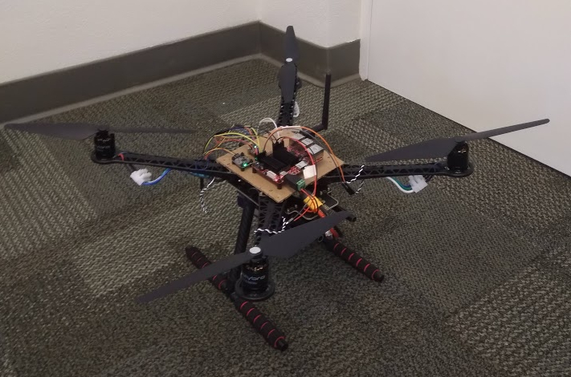

# quadcopter

This is a proof-of-concept attempt working towards building a Linux-based quadcopter flight control system. 

### Basis thesis

Many flight control systems are currently written on either bare metal or using an RTOS. These techniques are often less approachable to developers, as they tend to require somewhat complicated toolchains and either sophisticated simulators or hardware-in-the-loop development. Furthermore, this was often necessitated by relatively slow computation--the timing requirements on control loops meant that even a few years ago, it may have been difficult to run a non-deterministic control loop on a single-threaded board and be relatively certain that it would run quickly and reliably enough without the main thread hanging at any point. The past few years have seen many more low-cost, multi-threaded high performance ARM single-board computers running Linux become available, which may offer a way to build a flight-control system using only the board's standard I/O and a few peripherals, such that the native performance of the board is high enough maintain stable flight using an off-the-shelf Linux SBC. 

Notably, this idea was heavily explored by Anders Martenssson at the Blekinge Institute of Technology in their senior thesis [paper](https://www.diva-portal.org/smash/get/diva2:946992/FULLTEXT02.pdf), which seemed to indicate this approach could be relatively promising. 

### The hardware
This is the hardware I'm currently using. Most of these components could feasibly be switched out with something else if necessary (which is sort of the point), but in general you can assume that these will work together. 

- [Hardkernel Odroid-C4 4GB](https://wiki.odroid.com/odroid-c4/odroid-c4), running the most recent operating system and ideally with an eMMC module
    - *Why not a Raspberry Pi?* Raspberry Pis only have two hardware PWM channels, vs. six on the Odroid board. Also, they sometimes have I2C bugs that you can't fix without modifying the firmware in order to allow clock-stretching to work. The Odroid-C4 is also supposed to be a little bit faster. Also, the input voltage range is much larger, so it's possible to accept a 3S battery's input voltage directly without a step-down converter.
    - In order to access the PWM channels, you'll probably need to boot into the stock image, then modify the `/media/boot/config.ini` file to include `overlays = pwm_ab pwm_cd pwm_ef`. More details can be found on a Hardkernel forum post [here](https://forum.odroid.com/viewtopic.php?f=207&t=41185)
    - I've tried using [Armbian](https://www.armbian.com/), but peripheral support for all PWM channels is not built into the release by default, and I haven't been able to get channels C/D or E/F running. Getting channels A/B requires running a script using a device-tree compiler. For more information, take a look at an Armbian forum post [here](https://forum.armbian.com/topic/16356-missing-access-to-all-pwm-outputs/). If anyone reading this finds a simple way to add PWM/I2C support to Armbian for this board, switching operating systems should be trivial. 

- [Bosch BNO055 Absolute Orientation Sensor](https://www.adafruit.com/product/4646)
    - This runs over I2C using a Stemma QT connection on one end.

- [BMP280 Altitude/Pressure Sensor](https://www.adafruit.com/product/2651)
    - Also runs over I2C using a Stemma QT connection
    - Not that it particularly matters, but I recently helped update this sensor's Rust crate to the `2018` edition and should work out-of-the-box with an Odroid-C4

- Blue Robotics [BasicESC](https://bluerobotics.com/store/thrusters/speed-controllers/besc30-r3/)
    - These ESCs are great because they don't require calibration, but instead have a defined PWM signal range running from 1100-1900 microseconds, with 1500 us being the neutral position. 

- Brushless ESCs
    - I used [these](https://smile.amazon.com/gp/product/B0796RK6VY/ref=ppx_yo_dt_b_asin_title_o05_s00?ie=UTF8&psc=1) ones from Crazepony to start, but am currently working with a set of Holybro 2216 KV880v2 motors. 

- Frame
    - [Holybro S500](http://www.holybro.com/product/pixhawk4-s500-v2-kit/) frame, which I think is also sold by [ReadyToSky](https://smile.amazon.com/dp/B01N0AX1MZ/?coliid=I2FEQIGGD5136H&colid=2Y20EFE1AJ5HX&psc=1&ref_=lv_ov_lig_dp_it). This one's come in handy, because you can solder both the BasicESCs and the 5.5mm plug directly into the power/ground planes along with an XT-60 connector and run the entire thing off of a single 3S LiPo battery. 

Plus things like screw terminals, plastic rotors, a WiFi adapter for the Odroid-C4. As mentioned, for the motor power, I'm using a 3S/30C LiPo battery using XT-60 connectors, which is actually pretty important--I'm registering somewhere between 1.5-2.0A per motor to get flight at the moment, which was more than my 5A benchtop power supply could produce, so I had switch over to a LiPo battery for development. 

### Current state

Subsets of this code, with the described hardware have been proven to work on one and two-axis stabilization controls problems. In other words, a single motor/propeller on an unsupported lever arm can indefinitely maintain a level position with low oscillation. The same goes for an in-line pair of lift-producing motor on opposite sides of a pivot point. 

 I've also done some work with all four motors running, and holding a quadcopter chassis from the corner (I haven't finished the counter-rotation yet for the motors I've been using, so I can't let go entirely) the quadcopter is able to stay relatively level in plane with little input from my arm. When I kill the control signal, the chassis drops, so I believe it's safe to say that the attitude control system is at least close to working. 

### License
This code is licensed under GPLv3